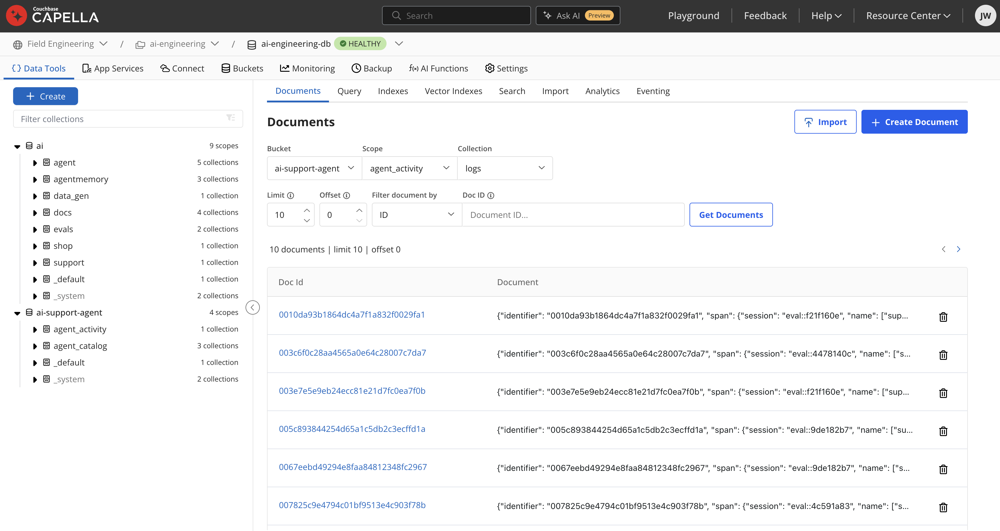
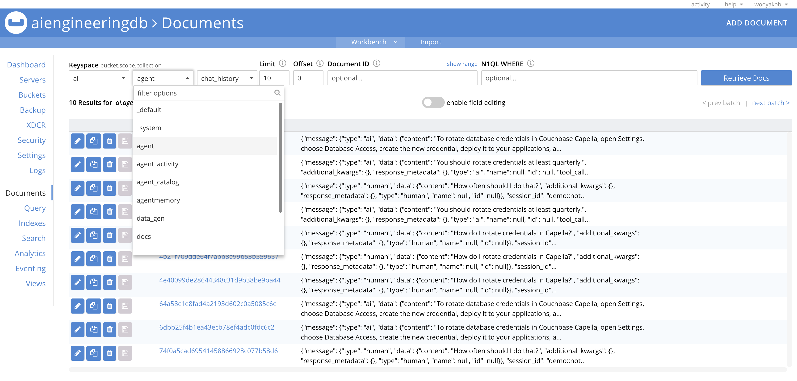

# AI Engineering on Couchbase
AI Engineering is the discipline of building applications with foundation models.

Couchbase is the **Operational Data Platform for AI**. We released the **AI Data Plane** (AIDP) to give production agents one governed data layer for memory, context, data access, tools, traces and cache.

The AIDP includes Agent Memory, Agent Catalog, AI Functions, MCP Server, Data Processing, Vectorization and Model Service.

A quick note on what it does not include out of the box:

- Orchestration is handled by LangGraph but CrewAI, LlamaIndex and Strands are also supported agent frameworks.
- Evaluation uses Ragas to run evals but eval runs are stored in Couchbase. There are alternative eval providers that'd work too.

The purpose of this Book, accompanying Notebooks and example Applications, is to make it easier to get started testing agentic workloads with Couchbase as an Agent's single data platform for knowledge, vectors, memory, tools, prompts, traces and evals.

System complexity and fragmented data architectures act as a barrier to entry for enterprises graduating agentic projects from proof of concept to production. It is far more likely to be a problem with data than model performance.

When an Agent is running in Production, troubleshooting across different systems requires herculean engineering effort and often the root cause can't be found, or when it is, it takes fixes across multiple systems, and careful execution without breaking things can be a headache.

I hope that this book acts as a helpful starting point for building agentic applications on Couchbase, in the environment of your choice.

> You should run AI workloads where it makes sense for your business.

### Fully Managed Environment


### Self Managed Environment


---

## Book Overview
This is a book with hands-on runnable companions. It includes 16 detailed chapters (`docs/`), 14 end-to-end notebooks (`notebooks/`), and 2 example AI applications (`apps/`), all built using the [Couchbase Python SDK](https://docs.couchbase.com/python-sdk/current/hello-world/overview.html).

| # | Chapter | Covers |
|---|---|---|
| 1 | [AI Engineering on Couchbase](docs/01-ai-engineering-on-couchbase.md) | Introduction to AI Engineering on Couchbase. The Couchbase Stack. Why Couchbase for Agentic applications.|
| 2 | [Couchbase Python SDK Foundations](docs/02-python-sdk-foundations.md) | Python SDK Fundamentals. KV Operations, Subdocuments, Durability, Async, Transactions. |
| 3 | [Data Processing for AI](docs/03-data-processing.md) | Good Data Management. Handling Unstructured Data. Chunking Strategies. Data Enrichment. Data Freshness. |
| 4 | [Embeddings & the Vectorization Service](docs/04-vectorization-service.md) | Introduction to Embeddings. Similarity Algorithms. Choosing Embedding Models. Auto Vectorisation. |
| 5 | [Vector Search](docs/05-vector-search.md) | The Search Service. Creating Vector Indexes. Full Text Search (FTS). Hybrid Searches. Tuning Retrieval Quality. |
| 6 | [Retrieval-Augmented Generation](docs/06-rag.md) | Grounding. RAG API. Multi Turn. Caching. |
| 7 | [AI Functions](docs/07-ai-functions.md) | AI Enrichment. Sentiment Analysis. Masking. Completion. |
| 8 | [The Capella Model Service](docs/08-model-service.md) | Model Caching. Guardrails. Data Co-location. |
| 9 | [Agent Memory](docs/09-agent-memory.md) | STM. LTM. Episodic. Semantic Recall. Agent Memory SDK. |
| 10 | [Agent Catalog](docs/10-agent-catalog.md) | Python Functions, SQL++ Query, Semantic Search, HTTP Request Tools. Semantic Tool Discovery. Git Versioning. Agent Traces. |
| 11 | [Orchestrating with LangGraph](docs/11-orchestration-langgraph.md) | Checkpoints. Support Agent. React Agents. |
| 12 | [The Couchbase MCP Server](docs/12-mcp-server.md) | Read Only. Claude Client. LangGraph MCP Tools. MCP Security. |
| 13 | [Evaluating with Ragas](docs/13-evaluation-ragas.md) | Eval Metrics. Querying Evals. Evaluating Agents. Evaluating RAG. |
| 14 | [Vector Index Architectures](docs/14-vector-index-architectures.md) | Couchbase 8. Hyperscale. Composite. Similarity Algorithms. Index Algorithms. Recall Tuning. |
| 15 | [Structured Outputs](docs/15-structured-outputs.md) | JSON Schemas. Pydantic Models. Model Selection. |
| 16 | [Conclusion](docs/16-conclusion.md) | Closing Thesis: Less System Complexity, One Operational Data Platform for AI. |

**Author:** *Jake Wood, Solutions Engineer at Couchbase*
**v1 Published:** *July 18, 2026*

The latest version of the Book, **AI Engineering on Couchbase**, can be downloaded as a PDF [here](https://github.com/wooyakob/couchbase-ai-engineering/releases/tag/book-pdf-latest) for reading offline.

The contents of this book can be shared and paraphrased, but not copied verbatim and claimed as your own, under copyright.

© 2026 Jake Wood.

---
## The Notebooks
Each notebook is the runnable form of one or more chapters.

1. [`01_python_sdk_quickstart`](notebooks/01_python_sdk_quickstart.ipynb): Connect, provision, KV/subdoc/TTL, SQL++
2. [`02_vector_search_fundamentals`](notebooks/02_vector_search_fundamentals.ipynb): Chunk → embed → index → semantic/hybrid/prefiltered search
3. [`03_rag_pipeline`](notebooks/03_rag_pipeline.ipynb): RAG chain, exact + semantic caching, conversational RAG
4. [`04_ai_functions`](notebooks/04_ai_functions.ipynb): SQL++ AI functions (Capella) + the portable equivalent
5. [`05_model_service`](notebooks/05_model_service.ipynb): Capella Model Service: chat, embeddings, cache, guardrails
6. [`06_agent_memory`](notebooks/06_agent_memory.ipynb): Session store, memory store, extraction, hygiene
7. [`07_agent_catalog_langgraph`](notebooks/07_agent_catalog_langgraph.ipynb): Cataloged tools/prompts + durable LangGraph agent
8. [`08_ragas_evaluation`](notebooks/08_ragas_evaluation.ipynb): Score the RAG pipeline, store runs, regression queries
9. [`09_agent_memory_managed`](notebooks/09_agent_memory_managed.ipynb): The managed Agent Memory server + SDK (the Ch. 9 §9.7–§9.8 track; needs a running Agent Memory Docker container)
10. [`10_structured_outputs`](notebooks/10_structured_outputs.ipynb): Pydantic-verified JSON generation, synthetic data, stored/queried in Couchbase (Ch. 15)
11. [`11_vector_index_architectures`](notebooks/11_vector_index_architectures.ipynb): Hyperscale & Composite vector indexes, recall/latency tuning, quantization tradeoffs (Ch. 14; needs **Couchbase Server / Capella 8.0+**)
12. [`12_mcp_server`](notebooks/12_mcp_server.ipynb): Connect to the Couchbase MCP server, call a tool directly, wire it into a LangGraph agent (Ch. 12; needs [`uv`](https://docs.astral.sh/uv/) for `uvx`)
13. [`13_eventing`](notebooks/13_eventing.ipynb): Deploy an Eventing function that reactively keeps derived AI data fresh on source mutation (Ch. 3 §3.6; needs the **Eventing service** enabled)
14. [`14_analytics_agent_tool`](notebooks/14_analytics_agent_tool.ipynb): Enable Analytics on a collection, run an aggregate usage report, hand it to an agent as a tool (Ch. 1, 10, 11; needs the **Analytics service** enabled)

Notebooks are generated from `notebooks/src/*.py` (jupytext percent format) via `python scripts/build_notebooks.py`. Edit the sources, not the `.ipynb`.

---

## The Apps
- **[`apps/rag-api`](apps/rag-api/)**. FastAPI RAG service: hybrid retrieval with tenant prefilters, query condensation, Couchbase-backed chat history, and every interaction logged for evaluation.
- **[`apps/support-agent`](apps/support-agent/)**. LangGraph support agent with Agent Catalog tools/prompts, user memory via the managed Agent Memory server + SDK, Couchbase checkpoints, optional MCP tools, and a pytest eval suite.

---

## Setup and Testing Requirements
### Setup
All functionality can be run using a paid Capella cluster that meets the prerequisites for AI capabilities such as AI Functions and Agent Catalog. See [AI Functions Prerequisites](https://docs.couchbase.com/ai/build/ai-functions.html#prerequisites) and [Agent Catalog Prerequisites](https://docs.couchbase.com/ai/build/integrate-agent-with-catalog.html#prerequisites).

You can create a free Capella cluster with Data, Index, Query and Search enabled. AI Functions can't be tested but the remaining functionality should work as expected based on the prerequisites. Note that notebooks 13 and 14 additionally require the **Eventing** and **Analytics** services, which are not available on the free tier.

### Testing
Every notebook is covered by an automated end-to-end suite (`pytest tests/test_notebooks.py`, executing each notebook for real, cell by cell, against a live cluster and model API) and has also been run through manually.

All 14 notebooks are verified against both **Couchbase Server 8.0+** and **Capella 8.0+**, the two backends this repo treats as equivalent, provided the Eventing and Analytics services are enabled (needed by notebooks 13 and 14). See the Quickstart's Server/Capella breakdown for the handful of Capella-only features.

### Troubleshooting
Something failing? [`docs/troubleshooting.md`](docs/troubleshooting.md) covers the common errors across every notebook and app. Connection/auth failures, index bucket-not-found, model errors, Agent Catalog, and the Agent Memory Docker setup.

---

## Quickstart

```bash
git clone <this repo> && cd ai-engineering
python3.12 -m venv .venv && source .venv/bin/activate
pip install -r requirements.txt

cp .env.server.example .env.server    # local Couchbase. Fill it in.
cp .env.capella.example .env.capella  # Capella. Fill it in.

ENV_FILE=.env.server jupyter lab notebooks/  # or ENV_FILE=.env.capella.
```

**Server or Capella, your choice. Most notebooks run against either.** `.env.server.example` and `.env.capella.example` are two complete, parallel configs (cluster connection, model provider, Agent Memory, Agent Catalog). Fill in whichever you'll use, then pick one per run by setting `ENV_FILE` before launching: every `load_dotenv()` call in this repo reads
`os.getenv("ENV_FILE", ".env")`, so unset `ENV_FILE` still falls back to a plain `.env` if you'd rather manage one file yourself.

**Running both at once:** `ENV_FILE` is a normal process environment variable, so two separate processes with different values are fully isolated: nothing gets overwritten.

Start two Jupyter instances on different ports, each in its own terminal:

```bash
ENV_FILE=.env.server  jupyter lab --port 8888 notebooks/
ENV_FILE=.env.capella jupyter lab --port 8889 notebooks/
```

Each notebook's kernel inherits whichever `ENV_FILE` its Jupyter process was started with. The same applies to `apps/rag-api` and `apps/support-agent`. This also extends to the Agent Memory server: run two containers, one per backend, on different host ports. See `.env.server.example` / `.env.capella.example` for the matching `docker run` commands (8081 vs 8080, so they don't collide either).

**Capella is required, not optional, for four things**. No local Couchbase equivalent.

1. **Chapter 8 / notebook 05: Model Service**: hosted models are a Capella feature.
2. **Chapter 10-11 / notebook 07: Agent Catalog UI**: the visual catalog browser lives in the Capella console (the `agentc` CLI/SDK itself works against either backend).
3. **Chapter 7 / notebook 04: Couchbase AI Functions**: `ai_sentiment`/`ai_summary` are Capella SQL++ functions.
4. **Chapter 3-4: Data Processing / Vectorization workflows**: the managed extract-chunk-embed-index pipeline is a Capella AI Services feature; DIY equivalents (used elsewhere in this repo) work on either backend.

Everything else (notebooks 01, 02, 03, 06, 08, 09, and both apps/) runs the same against a local Couchbase Server or Capella; just point `.env` at whichever.

You need a Couchbase cluster with Data + Query + Index + Search services and a bucket named `ai`: [Capella](https://cloud.couchbase.com/), or locally. Notebooks 13 (`13_eventing`) and 14 (`14_analytics_agent_tool`) additionally require the **Eventing** and **Analytics** services to be enabled.

```bash
docker run -d --name cb -p 8091-8097:8091-8097 -p 11210:11210 couchbase:enterprise
```

**You must create the `ai` bucket yourself** in the Couchbase Server or Capella UI before running notebook 01. It is not created for you.

Notebook 01 only provisions the scopes/collections *inside* an existing bucket. On Couchbase Server: `http://localhost:8091` → Buckets → Add Bucket → name it `ai`. On Capella: your cluster → Data Tools / Buckets → Create Bucket → name it `ai`.

> **Single-node Docker caveat:** a single `docker run couchbase:enterprise` container is one node. If you leave "Enable replicas" checked when creating the bucket, the UI will warn "you do not have enough data servers... to support this number of replicas": there's nowhere to put the replica copy. Uncheck replicas (or set the count to 0) for a single-node bucket, or add more `couchbase:enterprise` containers to the same cluster if you want replication.

Models default to OpenAI (`OPENAI_API_KEY`); set `CAPELLA_AI_ENDPOINT` to switch every notebook and app to Capella-hosted models (Chapter 8). Keep `OPENAI_API_KEY` set either way if you run the Agent Memory server (Ch. 9 §9.7): it uses OpenAI internally for its own fact extraction and embeddings.

---

Feedback is welcomed and encouraged.

- You can email me personally at **jake_wood@mac.com**.
- You can also raise issues, or submit PRs for review in this GitHub repo (see [contributing.md](./contributing.md)).