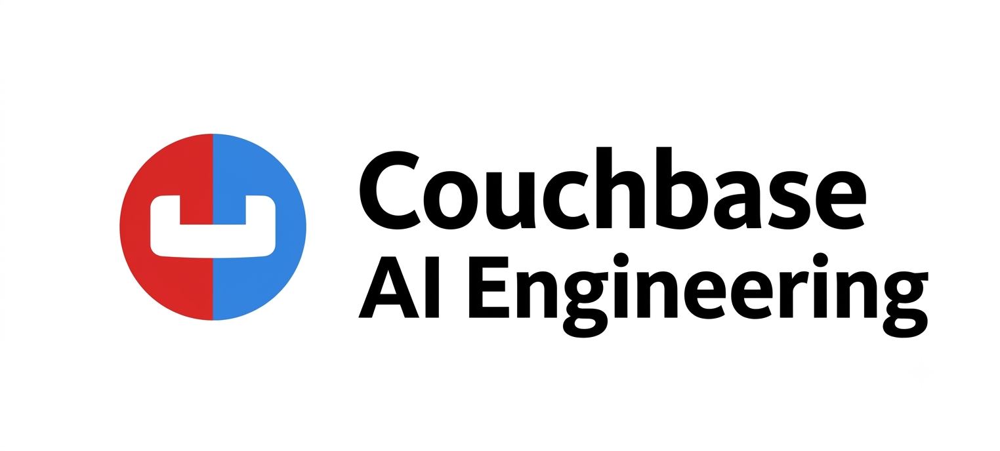

# AI Engineering on Couchbase

**Building applications with foundation models — with Couchbase as the single data
platform for knowledge, vectors, memory, agent assets, and evaluation.**

**Author:** Jake Wood, Solutions Engineer at Couchbase

© 2026 Jake Wood.

**[Download the whole book as a PDF](../../releases/tag/book-pdf-latest)** — regenerated
from `docs/` automatically on every push to `main` (see
[`.github/workflows/build-book-pdf.yml`](.github/workflows/build-book-pdf.yml)), so it
always matches this repo's current state.

This repo is a book with runnable companions: 15 detailed chapters
(`docs/`), 11 end-to-end notebooks (`notebooks/`), and 2 complete sample applications
(`apps/`), all built on the [Couchbase Python SDK](https://docs.couchbase.com/python-sdk/current/hello-world/overview.html).

**Tested.** Every notebook is covered by an automated end-to-end suite
(`pytest tests/test_notebooks.py` — executes each notebook for real, cell by cell,
against a live cluster and model API) and has also been run through manually. All 11
notebooks are verified against both **Couchbase Server 8.0.2** and **Capella (8.0.2)** —
the two backends this repo treats as equivalent (see the Quickstart's Server/Capella
breakdown for the handful of Capella-only features).

Two deliberate scope choices, stated up front:

- **Orchestration**: Couchbase does not ship an agent orchestration framework — we use
  **[LangGraph](https://langchain-ai.github.io/langgraph/)**, with Couchbase as its
  persistence layer (checkpoints, memory, tools, retrieval).
- **Evaluation**: Couchbase does not ship an eval framework — we use
  **[Ragas](https://docs.ragas.io/)**, and store every eval run in Couchbase so quality
  becomes a queryable time series.

## The book

| # | Chapter | Covers |
|---|---|---|
| 1 | [AI Engineering on Couchbase](docs/01-ai-engineering-on-couchbase.md) | The stack, the reference architecture, why one platform |
| 2 | [Python SDK Foundations](docs/02-python-sdk-foundations.md) | Connect (local/Capella), KV, subdocument, TTL, SQL++, provisioning |
| 3 | [Data Processing for AI](docs/03-data-processing.md) | Chunking strategies, idempotent pipelines, lineage, Eventing, AI-function enrichment |
| 4 | [Embeddings & the Vectorization Service](docs/04-vectorization-service.md) | Embedding mechanics, Capella auto-vectorization workflows vs. DIY, model migrations |
| 5 | [Vector Search](docs/05-vector-search.md) | Index definitions, `SearchRequest`/`VectorQuery`, hybrid search, prefilters, tuning |
| 6 | [Retrieval-Augmented Generation](docs/06-rag.md) | RAG chains, grounding, exact + semantic caching, multi-turn with chat history |
| 7 | [AI Functions](docs/07-ai-functions.md) | LLM tasks in SQL++: `ai_sentiment`, `ai_summary`, `ai_classification`, enrichment at rest |
| 8 | [The Capella Model Service](docs/08-model-service.md) | OpenAI-compatible hosted models, serving-layer cache, guardrails, model routing |
| 9 | [Agent Memory](docs/09-agent-memory.md) | Short-term (TTL sessions), long-term (vector recall), extraction, forgetting — from primitives *and* the managed Agent Memory server + SDK |
| 10 | [Agent Catalog](docs/10-agent-catalog.md) | `agentc`: versioned tools & prompts, semantic tool discovery, activity auditing |
| 11 | [Orchestrating with LangGraph](docs/11-orchestration-langgraph.md) | Graphs, the Couchbase checkpointer, catalog-driven nodes, the full state architecture |
| 12 | [The Couchbase MCP Server](docs/12-mcp-server.md) | Model Context Protocol, cluster access for AI tools, security posture |
| 13 | [Evaluating with Ragas](docs/13-evaluation-ragas.md) | RAG metrics, agent evals from activity logs, eval results as data, CI gates |
| 14 | [Vector Index Architectures](docs/14-vector-index-architectures.md) | Hyperscale & Composite (GSI) vector indexes, similarity metrics, IVF/quantization tuning, `APPROX_VECTOR_DISTANCE` |
| 15 | [Structured Outputs](docs/15-structured-outputs.md) | Pydantic-verified JSON generation, schema-mode fallback, synthetic data, querying validated structure |

## The notebooks

Each notebook is the runnable form of one or more chapters, in sequence — run 01 first
(it provisions the `ai` bucket everything else uses):

1. [`01_python_sdk_quickstart`](notebooks/01_python_sdk_quickstart.ipynb) — connect, provision, KV/subdoc/TTL, SQL++
2. [`02_vector_search_fundamentals`](notebooks/02_vector_search_fundamentals.ipynb) — chunk → embed → index → semantic/hybrid/prefiltered search
3. [`03_rag_pipeline`](notebooks/03_rag_pipeline.ipynb) — RAG chain, exact + semantic caching, conversational RAG
4. [`04_ai_functions`](notebooks/04_ai_functions.ipynb) — SQL++ AI functions (Capella) + the portable equivalent
5. [`05_model_service`](notebooks/05_model_service.ipynb) — Capella Model Service: chat, embeddings, cache, guardrails
6. [`06_agent_memory`](notebooks/06_agent_memory.ipynb) — session store, memory store, extraction, hygiene
7. [`07_agent_catalog_langgraph`](notebooks/07_agent_catalog_langgraph.ipynb) — cataloged tools/prompts + durable LangGraph agent
8. [`08_ragas_evaluation`](notebooks/08_ragas_evaluation.ipynb) — score the RAG pipeline, store runs, regression queries
9. [`09_agent_memory_managed`](notebooks/09_agent_memory_managed.ipynb) — the managed Agent Memory server + SDK (the Ch. 9 §9.7–§9.8 track; needs a running Agent Memory Docker container)
10. [`10_structured_outputs`](notebooks/10_structured_outputs.ipynb) — Pydantic-verified JSON generation, synthetic data, stored/queried in Couchbase (Ch. 15)
11. [`11_vector_index_architectures`](notebooks/11_vector_index_architectures.ipynb) — Hyperscale & Composite vector indexes, recall/latency tuning, quantization tradeoffs (Ch. 14; needs **Couchbase Server / Capella 8.0+**)

Notebooks are generated from `notebooks/src/*.py` (jupytext percent format) via
`python scripts/build_notebooks.py` — edit the sources, not the `.ipynb`.

Something failing? [`docs/troubleshooting.md`](docs/troubleshooting.md) covers the common
errors across every notebook and app — connection/auth failures, index/bucket-not-found,
model errors, Agent Catalog, and the Agent Memory Docker setup.

## The apps

- **[`apps/rag-api`](apps/rag-api/)** — a FastAPI RAG service: hybrid retrieval with
  tenant prefilters, query condensation, Couchbase-backed chat history, and every
  interaction logged for evaluation.
- **[`apps/support-agent`](apps/support-agent/)** — a LangGraph support agent with
  Agent Catalog tools/prompts, user memory via the managed Agent Memory server + SDK,
  Couchbase checkpoints, optional MCP tools, and a pytest eval suite.

## Quickstart

```bash
git clone <this repo> && cd ai-engineering
python3.12 -m venv .venv && source .venv/bin/activate
pip install -r requirements.txt

cp .env.server.example .env.server    # local Couchbase — fill it in
cp .env.capella.example .env.capella  # Capella — fill it in

ENV_FILE=.env.server jupyter lab notebooks/  # or ENV_FILE=.env.capella — start with 01
```

**Server or Capella, your choice — most notebooks run against either.** `.env.server.example`
and `.env.capella.example` are two complete, parallel configs (cluster connection, model
provider, Agent Memory, Agent Catalog). Fill in whichever you'll use, then pick one per
run by setting `ENV_FILE` before launching — every `load_dotenv()` call in this repo reads
`os.getenv("ENV_FILE", ".env")`, so unset `ENV_FILE` still falls back to a plain `.env` if
you'd rather manage one file yourself.

**Running both at once:** `ENV_FILE` is a normal process environment variable, so two
separate processes with different values are fully isolated — nothing gets overwritten.
Start two Jupyter instances on different ports, each in its own terminal:

```bash
ENV_FILE=.env.server  jupyter lab --port 8888 notebooks/
ENV_FILE=.env.capella jupyter lab --port 8889 notebooks/
```

Each notebook's kernel inherits whichever `ENV_FILE` its Jupyter process was started
with. The same applies to `apps/rag-api` and `apps/support-agent`. This also extends to
the Agent Memory server: run two containers, one per backend, on different host ports —
see `.env.server.example` / `.env.capella.example` for the matching `docker run` commands
(8081 vs 8080, so they don't collide either).

**Capella is required, not optional, for four things** — no local-Couchbase equivalent:
- **Chapter 8 / notebook 05 — Model Service**: hosted models are a Capella feature.
- **Chapter 10-11 / notebook 07 — Agent Catalog UI**: the visual catalog browser lives in the Capella console (the `agentc` CLI/SDK itself works against either backend).
- **Chapter 7 / notebook 04 — Couchbase AI Functions**: `ai_sentiment`/`ai_summary`/etc. are Capella SQL++ functions.
- **Chapter 3-4 — Data Processing / Vectorization workflows**: the managed extract→chunk→embed→index pipeline is Capella AI Services; DIY equivalents (used elsewhere in this repo) work on either backend.

Everything else — notebooks 01, 02, 03, 06, 08, 09, and both `apps/` — runs the same
against a local Couchbase Server or Capella; just point `.env` at whichever.

You need a Couchbase cluster with Data + Query + Index + Search services and a bucket
named `ai`: [Capella](https://cloud.couchbase.com/), or locally

```bash
docker run -d --name cb -p 8091-8097:8091-8097 -p 11210:11210 couchbase:enterprise
```

**You must create the `ai` bucket yourself** in the Couchbase Server or Capella UI
before running notebook 01 — it is not created for you. Notebook 01 only provisions
the scopes/collections *inside* an existing bucket. On Couchbase Server:
`http://localhost:8091` → Buckets → Add Bucket → name it `ai`. On Capella: your
cluster → Data Tools / Buckets → Create Bucket → name it `ai`.

> **Single-node Docker caveat:** a single `docker run couchbase:enterprise` container
> is one node. If you leave "Enable replicas" checked when creating the bucket, the UI
> will warn "you do not have enough data servers... to support this number of
> replicas" — there's nowhere to put the replica copy. Uncheck replicas (or set the
> count to 0) for a single-node bucket, or add more `couchbase:enterprise` containers
> to the same cluster if you want replication.

Models default to OpenAI (`OPENAI_API_KEY`); set `CAPELLA_AI_ENDPOINT` to switch every
notebook and app to Capella-hosted models (Chapter 8).

## Repo map

```
docs/                the book (15 chapters)
notebooks/           runnable companions (.ipynb generated from src/*.py)
apps/rag-api/        FastAPI RAG service
apps/support-agent/  LangGraph + Agent Catalog agent
indexes/             reusable Search index definitions
scripts/             notebook build tooling
```
