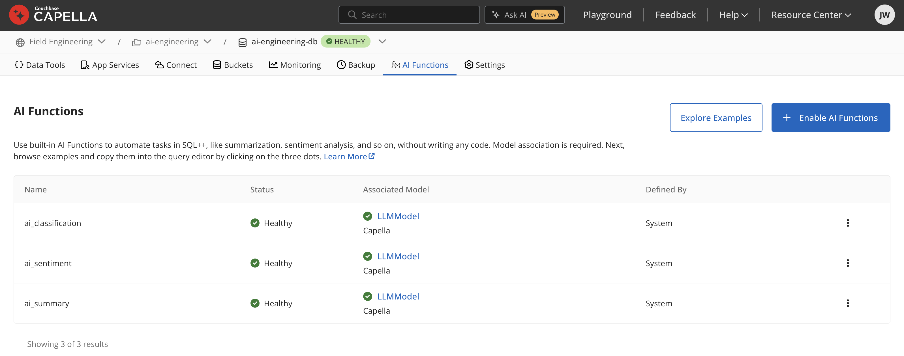

# Chapter 7: AI Functions, LLM Tasks in SQL++

> *The fastest way to add AI to an application is often not a new service, it's a new column in a query. Capella AI Functions let you summarize, classify, extract, mask, and generate text inside SQL++, so the model comes to the data instead of the data going to the model.*

---

## 7.1 The Idea

Most "AI features" in a product are not agents. They are *transformations*: summarize this ticket, tag this review, extract entities from this contract, redact PII before export, translate this description. Traditionally you'd build a worker service: read documents with the SDK, batch-call an LLM API, write results back, handle retries.

Capella **AI Functions** collapse that pipeline into SQL++. Each function call sends the field you select through a configured LLM and returns the result as part of the query. Because it's SQL++, you compose it with everything else the query service can do: `WHERE` filters, joins, `UPDATE ... SET`, aggregation over the results.

---

## 7.2 The Function Library

| Function | Task |
|---|---|
| `ai_sentiment` | Sentiment of text (positive / negative / neutral / mixed) |
| `ai_summary` | Condense long content |
| `ai_classification` | Categorize by labels you provide |
| `ai_extraction` | Extract entities you specify (people, places, order IDs, …) |
| `ai_corrected_grammar` | Fix grammar |
| `ai_generated_text` | Generate text from a prompt |
| `ai_masked` | Mask PII |
| `ai_similarity` | Compare two texts, return a similarity judgment |
| `ai_translation` | Translate between languages |
| `ai_completion` | Escape hatch: run an arbitrary prompt-defined task |

All functions take a JSON object argument with the input `text` plus generation controls such as `temperature` and `max_tokens`, and task-specific parameters (labels for classification, target language for translation, entity types for extraction).


*Each function is bound to a model deployment (here, `LLMModel` on Capella); swap the model without touching the SQL++ that calls it.*

---

## 7.3 Reading With AI: Enrich at Query Time

Sentiment over hotel reviews in `travel-sample` (functions live in a namespace `default:` here; use the namespace your cluster configured at deployment):

```sql
SELECT h.name,
       default:ai_sentiment({
           "text": r.content,
           "temperature": 0.0,
           "max_tokens": 200
       }) AS sentiment
FROM `travel-sample`.inventory.hotel AS h
UNNEST h.reviews AS r
LIMIT 5;
```

Classification with your own label set:

```sql
SELECT t.id,
       default:ai_classification({
           "text": t.body,
           "labels": ["billing", "bug", "feature-request", "account"],
           "temperature": 0.0,
           "max_tokens": 50
       }) AS category
FROM ai.support.tickets AS t
WHERE t.category IS MISSING
LIMIT 100;
```

From Python this is just a query (Chapter 2 covers the SDK):

```python
from couchbase.options import QueryOptions

result = cluster.query(
    """
    SELECT t.id,
           default:ai_summary({"text": t.body, "max_tokens": 150}) AS summary
    FROM ai.support.tickets AS t
    USE KEYS $keys
    """,
    QueryOptions(named_parameters={"keys": ["ticket::1001", "ticket::1002"]}),
)
for row in result:
    print(row["id"], "→", row["summary"])
```

---

## 7.4 Writing With AI: Enrich at Rest

Query-time enrichment re-pays the LLM cost on every read. For stable derived fields, materialize once with `UPDATE`:

```sql
UPDATE ai.support.tickets AS t
SET t.summary  = default:ai_summary({"text": t.body, "max_tokens": 120}),
    t.category = default:ai_classification({
        "text": t.body,
        "labels": ["billing", "bug", "feature-request", "account"]
    }),
    t.enriched_at = NOW_STR()
WHERE t.summary IS MISSING
LIMIT 500;
```

Run it in batches (`LIMIT` + a `WHERE ... IS MISSING` cursor) from a scheduled job. This is the "AI ETL" pattern, and it composes with Eventing (Chapter 3) if you want enrichment triggered on document mutation instead of on a schedule.

PII masking before data leaves a boundary:

```sql
SELECT default:ai_masked({"text": t.body}) AS safe_body
FROM ai.support.tickets AS t
WHERE t.id = $ticket_id;
```

---

## 7.5 The Escape Hatch: `ai_completion`

When the canned tasks don't fit, define the task in the prompt:

```sql
SELECT default:ai_completion({
    "text": "Rewrite the following release note for a non-technical audience, "
            || "one sentence, no jargon: " || n.body,
    "temperature": 0.3,
    "max_tokens": 120
}) AS friendly_note
FROM ai.product.release_notes AS n
WHERE n.version = "8.0.0";
```

Treat `ai_completion` like inline prompt engineering: keep the prompts short and deterministic.

---

## 7.6 Engineering Guidance

- **Determinism**: for enrichment tasks, set `"temperature": 0.0` and constrain `max_tokens`. You want a transform, not creativity.
- **Cost & latency**: each row = at least one model call. Enrich at rest (7.4) for anything read more than once; enrich at read (7.3) only for ad-hoc analysis. Never put an AI Function in a hot-path query behind a user request without a cache.
- **Batching**: use `LIMIT`-ed batched `UPDATE`s with an `IS MISSING` predicate so runs are idempotent and resumable.
- **Model choice**: AI Functions run against the model integration you configured. A small, fast model hosted in the Capella Model Service (same VPC, no egress) is usually the right default for classification/masking; reserve big models for `ai_summary`/`ai_completion` where quality shows.
- **Validation**: LLM output is still LLM output. For classification, check the returned label is in your label set before trusting it downstream; keep an `enriched_by`/`enriched_at` audit field on materialized results.

---

## 7.7 Where This Fits

AI Functions pair with:

- **Chapter 3**: pipelines that decide *when* enrichment runs (Eventing, batch jobs).
- **Chapter 4**: the Vectorization service, which is the same "AI at the data" idea applied to embeddings.
- **Chapter 8**: the Model Service that can back these functions.

Notebook: [`notebooks/04_ai_functions.ipynb`](../notebooks/04_ai_functions.ipynb).

Running into errors? See [Troubleshooting](troubleshooting.md).

Next: [Chapter 8: The Capella Model Service](08-model-service.md).
