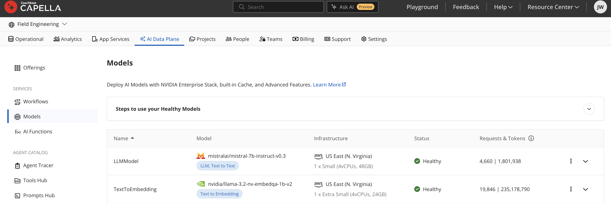

# Chapter 8: The Capella Model Service

> *Every chapter so far assumed "an embedding model" and "an LLM" exist somewhere. The Capella Model Service makes that somewhere be the same place as your data: models deployed next to the cluster, exposed through the OpenAI-compatible API your whole toolchain already speaks.*

---

## 8.1 What's the Model Service

The Capella **Model Service** (part of Capella AI Services) hosts foundation models (chat/completion LLMs and embedding models) inside Capella, network-adjacent to your database.

Three properties matter for engineering:

1. **OpenAI-compatible API.** The endpoint implements the OpenAI API surface (`/v1/chat/completions`, `/v1/embeddings`). Anything that can talk to OpenAI (the `openai` Python package, LangChain's `ChatOpenAI`/`OpenAIEmbeddings`, LlamaIndex's `OpenAILike`, LiteLLM) talks to the Model Service by changing `base_url`, `api_key`, and `model`.
2. **Data locality & privacy.** Prompts and documents don't leave your cloud perimeter to reach a third-party API. For regulated workloads this is often the deciding factor.
3. **Value-added serving.** The service can attach conversation caching (exact-match and semantic) and guardrails (e.g., Llama Guard content filtering) at the serving layer, configured when you deploy the model. These are features you'd otherwise build yourself.

Typical deployed models (pick per workload in the Capella UI): `meta-llama/Llama-3.1-8B-Instruct` for generation, `intfloat/e5-mistral-7b-instruct` for embeddings (2048 dimensions as deployed for this book — the model is 4096 natively; measure yours and remember the number: your vector indexes must match, see Chapter 5).


*Two deployments doing two jobs: an LLM for chat and a separate model for text-to-embedding, each shows its own request/token counters.*

---

## 8.2 Connecting

When you deploy a model you get an endpoint URL. Append `/v1` for the OpenAI-compatible base. Authentication uses a Capella AI API key, as used throughout the [vector-search-cookbook](https://github.com/couchbase-examples/vector-search-cookbook):

```python
import base64
import os

CAPELLA_AI_ENDPOINT = os.environ["CAPELLA_AI_ENDPOINT"]  # ends with /v1
# Prefer a Capella AI API key/token if the deployment issued one; otherwise
# fall back to database credentials encoded as base64 (username:password).
CAPELLA_AI_KEY = os.getenv("CAPELLA_AI_TOKEN") or base64.b64encode(
    f"{os.environ['CB_USERNAME']}:{os.environ['CB_PASSWORD']}".encode()
).decode()
```

### Raw `openai` client

```python
from openai import OpenAI

client = OpenAI(base_url=CAPELLA_AI_ENDPOINT, api_key=CAPELLA_AI_KEY)

# Chat
resp = client.chat.completions.create(
    model="meta-llama/Llama-3.1-8B-Instruct",
    messages=[
        {"role": "system", "content": "You are a concise assistant."},
        {"role": "user", "content": "What is Couchbase Vector Search?"},
    ],
    temperature=0,
)
print(resp.choices[0].message.content)

# Embeddings
emb = client.embeddings.create(
    model="intfloat/e5-mistral-7b-instruct",
    input=["couchbase vector search"],
)
vector = emb.data[0].embedding      # len == 2048 on this deployment — measure, don't assume
```

### LangChain

Two Capella-specific flags matter for embeddings: the hosted models are not tiktoken-based, so disable client-side token handling.

```python
from langchain_openai import ChatOpenAI, OpenAIEmbeddings

llm = ChatOpenAI(
    openai_api_base=CAPELLA_AI_ENDPOINT,
    openai_api_key=CAPELLA_AI_KEY,
    model="meta-llama/Llama-3.1-8B-Instruct",
    temperature=0,
)

embeddings = OpenAIEmbeddings(
    openai_api_base=CAPELLA_AI_ENDPOINT,
    openai_api_key=CAPELLA_AI_KEY,
    model="intfloat/e5-mistral-7b-instruct",
    check_embedding_ctx_length=False,   # Capella-specific
    tiktoken_enabled=False,             # Capella-specific
)
```

These two objects drop into every LangChain/LangGraph example in this book unchanged; that's the point of OpenAI compatibility. This book's examples default to OpenAI's API so they run for everyone, and each notebook has a clearly-marked cell like the above to switch to Capella.

---

## 8.3 Serving-Layer Caching

When you deploy a model you can enable response caching, backed by the cluster itself:

- **Standard (exact-match) cache**, identical request → stored response. Free wins for repeated queries (FAQ bots, retried jobs).
- **Semantic cache**, the service embeds incoming prompts and serves a cached response when a new prompt is *semantically similar* to a previous one, above a configured threshold.

The trade-off to engineer around: caching changes freshness and personalization semantics. Don't semantically cache prompts that embed per-user context (two users' "summarize my account" must not collide); do cache stable, user-independent Q&A. If you need application-level control instead, Chapter 6 builds the same two caches explicitly with `langchain-couchbase` (`CouchbaseCache`, `CouchbaseSemanticCache`) so you decide exactly what is cacheable.

---

## 8.4 Guardrails

Model deployments can attach a guardrail model (Meta Llama Guard family) that screens inputs/outputs for unsafe content categories you configure. A blocked request returns an error rather than a completion. Handle it:

```python
from openai import BadRequestError

try:
    resp = client.chat.completions.create(model=LLM_MODEL, messages=messages)
except BadRequestError as e:
    # guardrail violation surfaces as a 4xx with an explanatory body
    answer = "I can't help with that request."
```

Guardrails at the serving layer complement, not replace, application-level controls: retrieval filtering (don't retrieve what users shouldn't see, Chapter 5), tool permissioning (Chapter 10/12), and output validation.

---

## 8.5 Choosing Where Models Run

| Option | When |
|---|---|
| **Capella Model Service** | Data privacy requirements; predictable latency near the cluster; want serving-layer cache/guardrails; open-weight models are sufficient |
| **Frontier APIs** (OpenAI, Anthropic, Bedrock) | Need top-end reasoning quality (agent planning, complex synthesis); okay with data egress under DPA |
| **Both (common)** | Capella-hosted embeddings + small LLM for high-volume enrichment (AI Functions, Ch. 7) and RAG generation; frontier model for the agent's planner (Ch. 11) |

Because everything speaks the OpenAI protocol, this is a configuration decision, not an architecture decision. The switch is env-driven everywhere in this repo: `CAPELLA_AI_ENDPOINT`, `CAPELLA_AI_TOKEN`, `CAPELLA_LLM_MODEL`, `CAPELLA_EMBEDDING_MODEL`, `CAPELLA_EMBEDDING_DIM` for Capella, or `OPENAI_API_KEY`, `LLM_MODEL`, `EMBEDDING_MODEL` for OpenAI (see `.env.server.example` / `.env.capella.example`). `apps/rag-api/app/config.py` resolves these into its own internal `LLM_BASE_URL`/`LLM_API_KEY` names at import time; those are that app's derived variables, not ones you set directly. Whichever names you're setting, make sure the embedding dimension flows into your index definitions. Mismatched dimensions are the #1 vector-search setup error.

---

## 8.6 Operational Notes

- **Dimensions are a contract.** `text-embedding-3-small` → 1536; this book's Capella `e5-mistral-7b-instruct` deployment → 2048 (4096 natively). Changing embedding models means re-embedding the corpus and rebuilding the index. Record the model name on every embedded document (`"embedding_model": "..."`) so migrations are diffable.
- **Throughput**: batch embedding calls (the API accepts lists); the vectorization workflows of Chapter 4 do this for you.
- **Version pinning**: pin model names in config; "latest" aliases change under you and silently shift your embedding space or eval baselines (Chapter 13).

Notebook: [`notebooks/05_model_service.ipynb`](../notebooks/05_model_service.ipynb) exercises chat, embeddings, cache behavior, and a guardrail probe against a Capella endpoint (with an OpenAI fallback so it runs anywhere).

Running into errors? See [Troubleshooting](troubleshooting.md).

For schema-verified JSON generation (synthetic data, structured extraction) built on top of this chapter's endpoint, see [Chapter 15: Structured Outputs](15-structured-outputs.md).

Next: [Chapter 9: Agent Memory](09-agent-memory.md).
