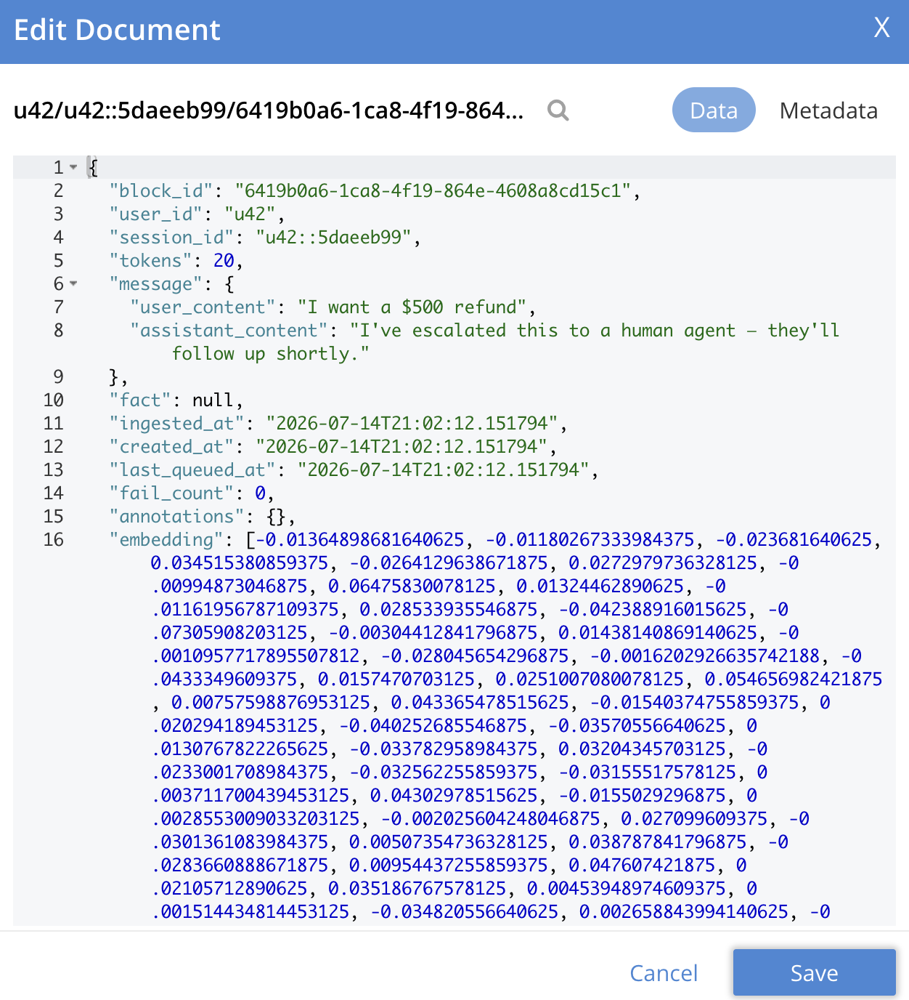
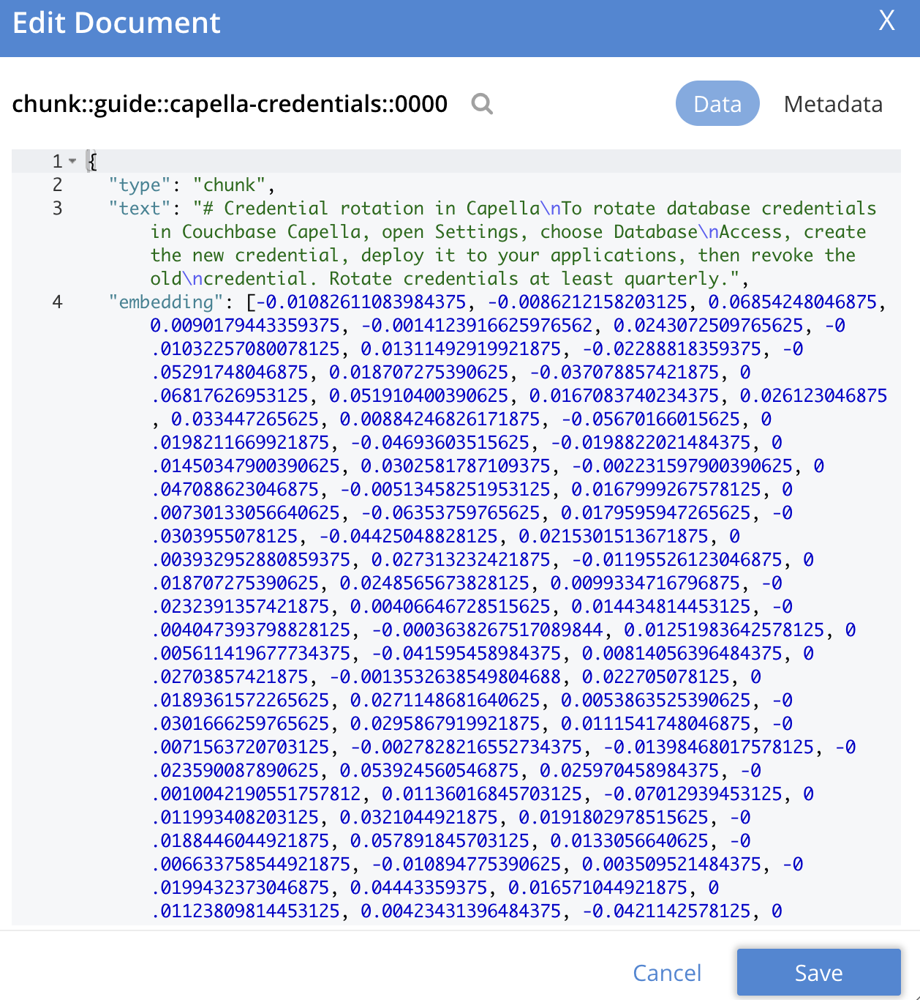

# Chapter 9: Agent Memory

> *An LLM is stateless and amnesiac: every request starts from nothing. Memory is what turns a chat completion into an agent. Memory is not a model feature; it's a database design. This chapter builds a complete memory subsystem on Couchbase.*

---

## 9.1 A Taxonomy That Maps to Collections
Agent memory splits into four kinds, each with a different access pattern, and each maps onto a Couchbase capability:

| Memory kind | Contents | Access pattern | Couchbase feature |
|---|---|---|---|
| **Short-term (STM)** | current conversation turns | read/write by session key, every turn | KV + subdocument, collection TTL |
| **Long-term (LTM)** | durable facts, preferences, learned knowledge | semantic recall ("what do I know about X?") | documents + vector search |
| **Working / checkpoint** | the agent graph's in-flight state | save/restore by thread | LangGraph checkpointer collections (Ch. 11) |
| **Episodic** | full traces of past runs | append-heavy writes, analytical reads | activity logs (Agent Catalog, Ch. 10) |

We implement STM and LTM here; checkpoints and episodes get their own chapters.

> Couchbase ships a managed Agent Memory product: an Agent Memory server (a Docker container) plus the `couchbase-agent-memory` Python SDK. Together they implement everything below (facts, embeddings, semantic recall, TTL, extraction, forgetting) as a service backed by your cluster, on self-managed or Capella. §9.2–§9.6 build the same ideas from SDK primitives so you understand exactly what memory is on a database; §9.7–§9.8 then show the managed product and when to pick each.

The `apps/support-agent` uses the managed product; [`notebooks/06`](../notebooks/06_agent_memory.ipynb) is the from-primitives track and [`notebooks/09`](../notebooks/09_agent_memory_managed.ipynb) is the managed one.

---

## 9.2 Short-Term Memory: Sessions

A session is one document; turns are appended with subdocument ops (no read-modify-write race, no shipping the whole transcript over the wire each turn):

```python
import couchbase.subdocument as SD
from couchbase.exceptions import DocumentNotFoundException
from couchbase.options import UpsertOptions

class SessionStore:
    def __init__(self, cluster, ttl=timedelta(hours=24)):
        self.coll = cluster.bucket("ai").scope("agent").collection("sessions")
        self.ttl = ttl

    def append_turn(self, session_id: str, role: str, content: str):
        key = f"session::{session_id}"
        turn = {"role": role, "content": content, "ts": now_iso()}
        try:
            self.coll.mutate_in(key, (
                SD.array_append("turns", turn),
                SD.upsert("last_active", turn["ts"]),
            ))
        except DocumentNotFoundException:
            self.coll.upsert(key, {"session_id": session_id, "turns": [turn],
                                   "last_active": turn["ts"]},
                             UpsertOptions(expiry=self.ttl))
        self.coll.touch(key, self.ttl)          # sliding expiry: active sessions live on

    def recent_turns(self, session_id: str, n: int = 10) -> list[dict]:
        try:
            doc = self.coll.get(f"session::{session_id}").content_as[dict]
        except DocumentNotFoundException:
            return []
        return doc["turns"][-n:]
```

Design notes:

- **TTL is the feature.** STM *should* forget; the collection was created with `max_expiry=timedelta(days=7)` (§2.2) as a backstop, and `touch()` implements sliding expiration. No cron jobs, no cleanup code.
- **Windowing at read time** (`turns[-n:]`) keeps prompts bounded. When a session outgrows the window, summarize (§9.5).
- If you'd rather not own this class, `CouchbaseChatMessageHistory` (§6.4) is the LangChain-shaped equivalent. Build your own when you need control over windowing, TTL, and summarization; use the integration when you don't.


*This is what one exchange looks like once stored, `user_id`/`session_id` scope recall, `fact` stays null for a raw message block (it's populated for extracted facts, §9.3–§9.4).*

---

## 9.3 Long-Term Memory: Semantic Recall

LTM stores *facts extracted from conversations*, embedded for semantic retrieval. A memory document:

```json
{
  "type": "memory",
  "user_id": "u42",
  "text": "Prefers Python examples over Java; works on a payments platform",
  "kind": "preference",
  "importance": 0.8,
  "embedding": [ ... ],
  "created_at": "2026-07-05T10:12:00Z",
  "source_session": "u42::2026-07-05",
  "access_count": 3
}
```

The store write path embeds, read path is a vector search with a **user prefilter** (memory recall must never cross users):

```python
import couchbase.search as search
from couchbase.options import SearchOptions
from couchbase.vector_search import VectorQuery, VectorSearch

class MemoryStore:
    def __init__(self, cluster, embed_fn):
        self.scope = cluster.bucket("ai").scope("agent")
        self.coll = self.scope.collection("memories")
        self.embed = embed_fn

    def remember(self, user_id: str, text: str, kind: str = "fact",
                 importance: float = 0.5):
        key = f"memory::{user_id}::{uuid4().hex[:12]}"
        self.coll.upsert(key, {
            "type": "memory", "user_id": user_id, "text": text,
            "kind": kind, "importance": importance,
            "embedding": self.embed(text),
            "created_at": now_iso(), "access_count": 0,
        })
        return key

    def recall(self, user_id: str, query: str, k: int = 5) -> list[dict]:
        req = search.SearchRequest.create(
            VectorSearch.from_vector_query(VectorQuery(
                "embedding", self.embed(query), num_candidates=k * 3,
                prefilter=search.MatchQuery(user_id, field="user_id"),
            )))
        result = self.scope.search("memories-vector-index", req,
                                   SearchOptions(limit=k, fields=["text", "kind", "importance"]))
        return [{"id": r.id, "score": r.score, **r.fields} for r in result.rows()]
```

(The index is the Chapter 5 definition pointed at `agent.memories`, with `user_id` indexed as a text field for the prefilter.)


*Same shape either way: text plus an `embedding` vector on the document. Whether it's an extracted fact or a retrieval chunk, this is the record semantic recall searches over.*

---

## 9.4 Writing Memories: Extraction

Who decides what's worth remembering? Two production patterns:

**Explicit tool**: give the agent a `remember` tool and let it decide (Chapter 10 catalogs it, Chapter 11 wires it):

```python
@agentc.catalog.tool
def save_memory(user_id: str, fact: str, kind: str) -> str:
    """Save a durable fact about the user for future conversations.
    Use when the user states a lasting preference, constraint, or correction."""
    return memory_store.remember(user_id, fact, kind)
```

**Background extraction**: after a session ends, an LLM pass over the transcript extracts memory-worthy facts. Cheap trigger: run it when the session document's TTL is near, or via Eventing on a `closed` flag (§3.6). Extraction prompt essentials: extract *stable* facts only, one fact per item, include a confidence score → `importance`.

Dedup on write, or memory fills with near-copies of "user prefers Python": before upserting, `recall(user_id, new_fact, k=1)` and skip/merge if similarity exceeds a threshold.

---

## 9.5 Summarization: Compressing STM Into LTM

When a session exceeds its window, fold it into a summary memory:

```python
def summarize_session(session_id: str, user_id: str):
    turns = session_store.recent_turns(session_id, n=10_000)
    transcript = "\n".join(f"{t['role']}: {t['content']}" for t in turns)
    summary = llm.invoke(
        f"Summarize durable facts and open tasks from this conversation, "
        f"3 bullets max:\n\n{transcript}").content
    memory_store.remember(user_id, summary, kind="episode_summary", importance=0.6)
```

The agent's prompt then assembles memory tiers explicitly, recent turns verbatim, older context as summaries, LTM by relevance:

```
System: ...instructions...
Relevant memories:      ← memory_store.recall(user_id, current_message, k=5)
Conversation summary:   ← episode summaries
Recent turns:           ← session_store.recent_turns(session_id, 10)
User: <current message>
```

That assembly *is* context engineering: three queries against one database.

---

## 9.6 Forgetting, Aging, and Hygiene

- **Relevance decay**: rank recall by `score × importance × recency`. Store `access_count`/`last_accessed` (a `mutate_in` counter on read), memories never recalled are candidates for expiry.
- **Corrections**: when the user contradicts a memory ("actually I moved teams"), *replace*, don't accumulate: recall nearest, remove it, remember the correction.
- **Right to be forgotten**: memory-per-document makes GDPR deletion a query, `DELETE FROM ai.agent.memories m WHERE m.user_id = $u`, plus session removal. Auditable with SQL++. This is harder when memory lives inside opaque framework state.
- **Never store secrets** in memory text: it gets injected into future prompts.

---

## 9.7 The Managed Alternative: The Agent Memory Server

Everything in §9.2–§9.6 is *worth understanding*, but in production you usually don't want to own the embedding calls, the dedup thresholds, the extraction prompt, the aging job, and the vector index.

Couchbase's **Agent Memory** product packages all of it behind an API.

The shape is three layers:

```
   your app  --(couchbase-agent-memory SDK / REST)-->  Agent Memory server  -->  Couchbase / Capella
 (LangGraph,                                          (stateless Docker container;      (users, sessions,
  CrewAI, ...)                                         embeds, extracts facts,           memory blocks,
                                                        ranks, expires TTLs)              vectors, managed)
```

The server is **stateless**, all durable state is in your cluster, so you scale it horizontally and it works the same against a local Couchbase or a **Capella** cluster. Its data model is a hierarchy:

- **User**: one per application user; the isolation boundary (recall never crosses users).
- **Session**: one per conversation or workflow run; `active` or `ended`.
- **Memory block**: the unit of storage: a **message** exchange or an extracted **fact**, each carrying a vector embedding, an LLM-generated summary, a timestamp (for conflict resolution), a status, and annotations.

That maps straight onto §9.1: sessions are STM, facts are LTM, and the server does the embedding + semantic search + TTL you'd otherwise hand-build.

### Deploy the server

Both pieces are GA, but distributed differently. The **`couchbase-agent-memory` SDK** (client-side, §9.8) is a normal GA package on PyPI: `pip install couchbase-agent-memory`.

The **Agent Memory server** is also GA, but it isn't published to a public registry; you get the container image by signing up for the free trial and downloading the packaged image (a `.tar`, e.g. `agentmemory-server-arm64-v1.0.0.tar`). `docker load -i`
takes that path relative to your current directory, so either `cd` into wherever you downloaded it before running this, or pass the full path:

```bash
docker load -i agentmemory-server-arm64-v1.0.0.tar   # run from the download's directory,
                                                       # or use its full path instead
```

Don't commit the `.tar` (or `ca.pem`, once you have it); they're a large binary and a cluster credential respectively, not project source.

It's a container you point at your cluster with an env file `.env.server` or `.env.capella` (see `.env.server.example` / `.env.capella.example`) each doubles as this `--env-file`, so there's nothing extra to create. `:arm64` tag on Apple Silicon, `:amd64` `--platform linux/amd64` on Intel.

**Local Couchbase Server**, note `host.docker.internal`, not `localhost`: inside the container, `localhost` means the container itself, not your host machine where Couchbase is running. Port `8081` (not `8080`) so this can run alongside a
Capella-pointed instance without a clash:

```bash
docker run -d --name agentmemory-server-local \
  --env-file .env.server \
  -p 8081:8080 -p 9091:9090 \
  -v agentmemory-local-logs:/app/logs \
  --restart unless-stopped \
  agentmemory-server:arm64   # :amd64 + --platform linux/amd64 on Intel
```

`.env.server` must set `AGENTMEMORY_CONN_STRING=couchbase://host.docker.internal` for this to connect (not `couchbase://localhost`, that's for code running outside Docker).

**Capella** additionally needs the cluster's root certificate. TLS (`couchbases://`) connections fail without it. In the Capella UI: your cluster → **Connect** tab → **Security Certificates** (or **Certificate**) → **Download Certificate**.

Save it as `ca.pem` in the directory you'll run this command from (the `-v` mount below reads it from there), then:

```bash
docker run -d --name agentmemory-server-capella \
  --env-file .env.capella \
  -p 8080:8080 -p 9090:9090 \
  -v agentmemory-capella-logs:/app/logs \
  -v $(pwd)/ca.pem:/app/certs/ca.pem:ro \
  --restart unless-stopped \
  agentmemory-server:arm64   # :amd64 + --platform linux/amd64 on Intel
```

`.env.capella` must have `AGENTMEMORY_CONN_ROOT_CERTIFICATE=/app/certs/ca.pem` uncommented (that's the path *inside* the container, matching the `-v` mount above, not a path on your host) and `AGENTMEMORY_BUCKET=ai`, reuse the same bucket as
everything else in this repo; the server provisions its own scopes/collections inside whatever bucket you point it at, so a separate one isn't needed.

Both instances can run at once (different ports, different container names) if you want to develop against local Couchbase and a Capella cluster side by side. Port `9090`/`9091` exposes Prometheus metrics; `http://localhost:8080/docs` (or `:8081`) is the interactive OpenAPI reference.

#### Troubleshooting

| Error message | Cause | Fix |
|---|---|---|
| `Unable to find image 'agentmemory-server:arm64' locally` / `pull access denied for agentmemory-server, repository does not exist` | Docker didn't find that exact tag locally, so it tried (and failed) to *pull* it from a registry: this image is never published, only distributed as the `.tar`. Usually means `docker load` used a different tag than the `docker run` command. Run `docker images \| grep agentmemory-server` to see what tag actually loaded (e.g. `v1.0.0`, not `arm64`). | Either `docker tag agentmemory-server:<loaded-tag> agentmemory-server:arm64` to match these commands, or edit the `docker run` command to use `<loaded-tag>` directly. |
| `Bind for 0.0.0.0:8080 failed: port is already allocated` | Something else already has that host port, most often a leftover container from an earlier/unrelated setup. Run `docker ps -a` to see what's holding it. | Stop/remove the old container (`docker rm -f <name>`) if it's stale, or change this command's `-p` mapping (e.g. `-p 8082:8080`) and point `AGENTMEMORY_BASE_URL` at the new port instead. |
| Container shows `Up ... (unhealthy)` or keeps restarting | The process inside is crash-looping: almost always a bad `--env-file` value, not a Docker problem. Check `docker logs <name> --tail 50` for the real Python traceback (connection refused, auth failure, cert not found, etc.), and `docker inspect <name> --format '{{range .Config.Env}}{{println .}}{{end}}'` to confirm which env values it's actually running with (a stale container may not reflect your current `.env.capella`/`.env.server`). | Fix the offending env var, then `docker rm -f <name>` and re-run; `--env-file` is read once at container creation, so editing the file doesn't affect an already-running container. |
| `x509: certificate signed by unknown authority` or a TLS handshake error in `docker logs` | `AGENTMEMORY_CONN_ROOT_CERTIFICATE` doesn't match a real, readable file inside the container, usually the `-v $(pwd)/ca.pem:...` mount pointed at the wrong directory, or `ca.pem` wasn't downloaded yet. | Confirm `ca.pem` exists in the directory you ran `docker run` from, and that `docker inspect <name> --format '{{range .Mounts}}{{.Source}} -> {{.Destination}}{{end}}'` shows it mounted to `/app/certs/ca.pem`. |
| `AGENTMEMORY_CONN_STRING` connects to the wrong cluster/bucket | A previously-created container keeps its env from *creation time*: re-running `docker run --env-file` with the same `--name` fails (name already in use) rather than updating it. | `docker rm -f <name>` before re-running after any `.env.*` change; there's no "reload env" for a running container. |

The common thread: `docker logs <name> --tail 50` is the first move for anything past "container won't start"; the error above the traceback (connection refused, auth failed, cert not found) tells you which env var is wrong far faster than guessing.

---

## 9.8 Using the Agent Memory SDK

`pip install couchbase-agent-memory` (Python 3.12+).

The client is hierarchical:

client → user → session → memory blocks

Everything is one HTTP call:

```python
from agentmemory import AgentMemoryClient, ChatMessage

with AgentMemoryClient(base_url="http://localhost:8080") as client:  # token="…" if OIDC
    user = client.create_user(user_id="u42", name="Ada")            # get_user() if it exists
    session = user.create_session(session_id="u42::2026-07-05")

    # Store a conversation exchange (the server extracts + embeds it)…
    session.add_memory(messages=[ChatMessage(
        user_content="My payments keep failing at checkout.",
        assistant_content="Are you seeing a specific error code?")])

    # …or a discrete fact. async_processing=False blocks until it's searchable.
    session.add_memory(facts=["Prefers Python examples, never Java."],
                       async_processing=False)

    # Semantic recall (across this session, listed sessions, or all of the user's):
    results = session.search_memory(
        query="what language should examples use?",
        filters={"session_ids": "all", "relevant_k": 5})
    for block in results.memory_blocks:
        print(block.rel_score, block.fact or block.summary)
```

The pieces that replace §9.2–§9.6, one for one:

| You built (§) | Managed equivalent |
|---|---|
| `SessionStore` subdoc appends + TTL (§9.2) | `session.add_memory(messages=…)`; TTL via `memory_blocks_ttl` / `user.modify_ttl(...)` |
| `MemoryStore.remember` + embed + dedup (§9.3–§9.4) | `session.add_memory(facts=…)` server embeds, summarizes, timestamps |
| Background extraction (§9.4) | the server's LLM extracts facts from message blocks for you |
| `recall` vector search + user prefilter (§9.3) | `session.search_memory(query, filters={"session_ids": "all"})` isolation is built in |
| Aging / TTL job (§9.6) | block/session/user TTL; `0` = never expire |
| GDPR delete (§9.6) | `client.delete_user(user_id)` cascades to every session and block |

**Design rules that matter** (they mirror §9.6's warnings): one Agent Memory user per real user and one session per conversation, sharing them contaminates recall; annotation keys are exact-match filters (no hyphens/dots/spaces), define a small vocabulary up front; and `async_processing=True` (the default) means a block isn't searchable until its status reaches `ready` a second or two later.

**How `apps/support-agent` wires it** ([`agent/memory.py`](../apps/support-agent/agent/memory.py)): durable facts land in a stable per-user `profile` session; each conversation is its own session; `recall()` searches `session_ids="all"` so both past dialogs and saved facts surface; the `save_memory` tool calls `add_memory(facts=…)`; and recall is wrapped to degrade to *no memories* if the server is offline, so it never breaks a turn. The client is a lazily-opened singleton, construction doesn't connect, the first request does.

**When to build your own instead (§9.2–§9.6):** you need memory in the same transaction as other writes, a bespoke ranking (`score × importance × recency`), or an embedding/extraction policy the server doesn't expose, or you simply can't run another container. Otherwise, reach for the managed product.

---

## 9.9 Recap

Two routes to the same place.

**From primitives** (§9.2–§9.6): memory is four collections and two access patterns you already know, KV/subdoc with TTL (Ch. 2) and vector search with a user prefilter (Ch. 5).

**Managed** (§9.7–§9.8): the Agent Memory server + `couchbase-agent-memory` SDK do the embedding, extraction, ranking, TTL, and GDPR delete for you, on self-managed or Capella. Build your own for control; run the server for production, the `apps/support-agent` does the latter.

Either way, Chapter 11 consumes memory the same way: recall as context assembly in a `load_context` node, `save_memory` as a tool, and LangGraph checkpoints (via `CouchbaseSaver`) as working memory.

Notebooks: [`06_agent_memory`](../notebooks/06_agent_memory.ipynb) (from primitives) and [`09_agent_memory_managed`](../notebooks/09_agent_memory_managed.ipynb) (managed server + SDK).

Running into errors? See [Troubleshooting](troubleshooting.md).

Next: [Chapter 10: Agent Catalog](10-agent-catalog.md).
