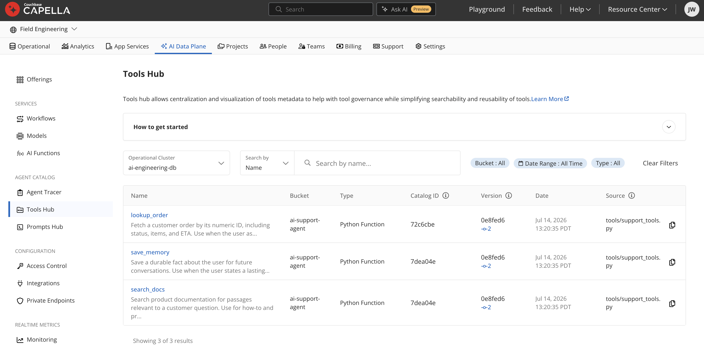
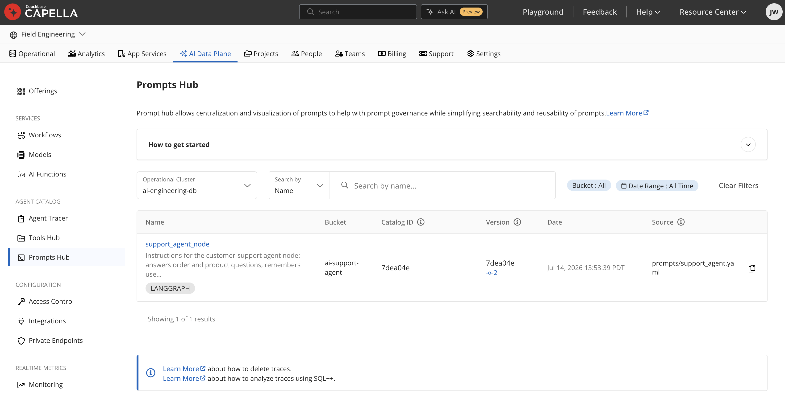
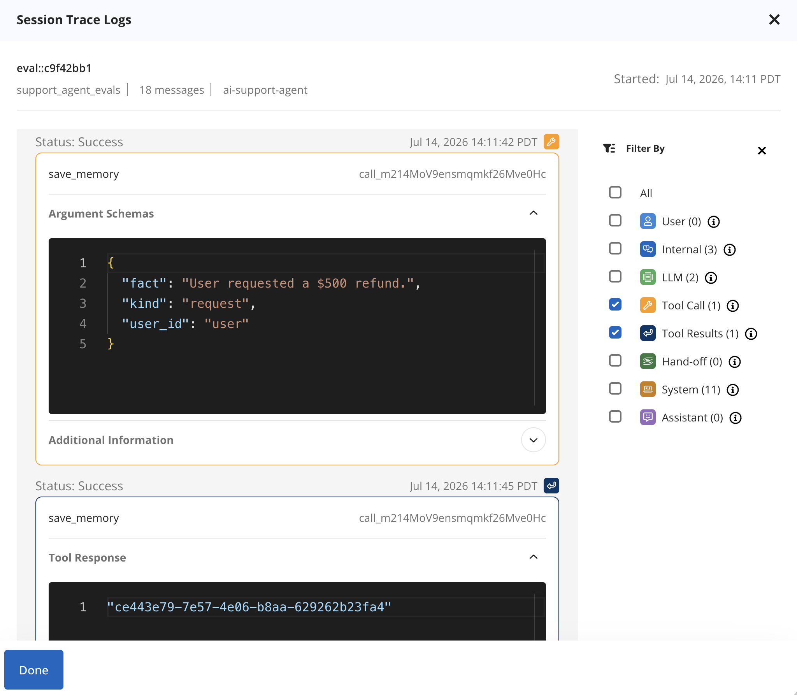

# Chapter 10: Agent Catalog

> *The second agent you build starts duplicating the first one's tools and prompts; the fifth developer can't find any of them; and when something goes wrong in production nobody can say which prompt version was running. Couchbase Agent Catalog (`agentc`) exists for exactly this: version, search, and audit your agents' building blocks in Git and in Couchbase.*

---

## 10.1 What Is Agent Catalog?

[Agent Catalog](https://github.com/couchbaselabs/agent-catalog) is three connected things:

1. **A tool catalog**: agent tools (Python functions, SQL++ queries, semantic searches, HTTP calls) declared in files, indexed with embeddings, findable by name or by *meaning* ("find me a tool for flight lookups").
2. **A prompt catalog**: prompts as versioned YAML records, which can declare *which tools they need*.
3. **An activity store**: structured logs (Spans) of everything your agent did, written to Couchbase for SQL++ analysis.

The versioning model: catalog snapshots are keyed to **Git commits** (`agentc publish` refuses a dirty repo), and every activity log carries the catalog version that produced it. "What exactly was agent v`59944db` running when it said that?" becomes a JOIN.

Install and storage:

```bash
pip install agentc          # + extras: agentc[langchain,langgraph]
```

In your bucket, `agentc init` creates two scopes: `agent_catalog` (collections `tools`, `prompts`, `metadata` with vector indexes over descriptions) and `agent_activity` (collection `logs`, plus SQL++ views/UDFs like `Sessions()` and `ToolInvocations()`). Configuration comes from `AGENT_CATALOG_*` environment variables (or `.env`):

```bash
AGENT_CATALOG_CONN_STRING=couchbases://cb.xxxx.cloud.couchbase.com
AGENT_CATALOG_USERNAME=...
AGENT_CATALOG_PASSWORD=...
AGENT_CATALOG_BUCKET=ai
AGENT_CATALOG_CONN_ROOT_CERTIFICATE=/path/to/cert   # required for couchbases://
```

**One bucket per project, not one bucket for everything.** `agentc` has no per-project namespacing: "latest catalog snapshot" is resolved **bucket-wide**, the query is
`WHERE t.kind = $kind ORDER BY version.timestamp DESC LIMIT 1` across *every* project ever published into that bucket, not scoped to a project's own commits.

If two separate projects both publish into `AGENT_CATALOG_BUCKET=ai`, whichever was `agentc publish`ed
**most recently** silently becomes "the" catalog for both: the other's tool/prompt lookups start returning empty, with no error to point at why. This repo hits exactly that: notebook 07's scratch `agentc_demo` catalog and `apps/support-agent`'s real catalog would collide if they shared a bucket, so `apps/support-agent` uses its own dedicated `AGENT_CATALOG_BUCKET` (`ai-support-agent` by convention) instead, see that app's
README, "Why a separate file," for the full mechanism.

Give each Agent Catalog project its own bucket.

---

## 10.2 Declaring Tools

Four kinds. All carry a mandatory **description**; that's what gets embedded and searched.

**Python function**: decorate; the docstring is the contract:

```python
# tools/find_orders.py
import agentc

@agentc.catalog.tool
def find_recent_orders(user_id: str, limit: int = 5) -> list[dict]:
    """Find a user's most recent orders, newest first.
    Use when the user asks about order status or history."""
    rows = cluster.query(
        "SELECT o.* FROM ai.shop.orders o WHERE o.user_id = $uid "
        "ORDER BY o.created_at DESC LIMIT $lim",
        QueryOptions(named_parameters={"uid": user_id, "lim": limit}))
    return list(rows)
```

**SQL++ query tool**: a `.sqlpp` file whose header comment is the metadata; `$parameters` map to the input schema. No Python needed, `agentc` code-generates the callable:

```sql
/*
name: find_direct_routes_between_airports
description: >
    Find direct routes between two airports given their IATA codes.
input:
    type: object
    properties:
      source_airport: { type: string }
      destination_airport: { type: string }
secrets:
    - couchbase:
        conn_string: CB_CONN_STRING
        username: CB_USERNAME
        password: CB_PASSWORD
*/
SELECT VALUE {"airline": r.airline, "from": r.sourceairport, "to": r.destinationairport}
FROM `travel-sample`.inventory.route r
WHERE r.sourceairport = $source_airport
  AND r.destinationairport = $destination_airport
LIMIT 10;
```

**Semantic search tool**: YAML descriptor over a vector index:

```yaml
record_kind: semantic_search
name: search_product_docs
description: >
  Find documentation chunks relevant to a customer question.
input: >
  {"type": "object", "properties": {"question": {"type": "string"}}}
secrets:
  - couchbase: {conn_string: CB_CONN_STRING, username: CB_USERNAME, password: CB_PASSWORD}
vector_search:
  bucket: ai
  scope: docs
  collection: chunks
  index: chunks-vector-index
  vector_field: embedding
  text_field: text
  embedding_model:
    name: sentence-transformers/all-MiniLM-L12-v2
  num_candidates: 5
```

**HTTP request tool**: point at an OpenAPI spec; each listed operation becomes a tool.

`agentc index` imports your Python tool files to discover them, import-time side effects must be safe, and runtime-only scripts belong in `.agentcignore`.


*Every published tool, searchable by name, with the Git commit (`Version`) and source file it came from: the audit trail from §10.1 made visible.*

---

## 10.3 Declaring Prompts

Prompts are YAML records; the `tools` block is the notable feature, a prompt declares the tools it needs, by name or by semantic query, and they're fetched with it:

```yaml
# prompts/support_agent.yaml
record_kind: prompt
name: support_agent_node
description: >
  Instructions for the customer-support agent node.
annotations:
  framework: "langgraph"
tools:
  - name: "find_recent_orders"
  - query: "searching documentation for product questions"
    limit: 1
output:
  type: object
  properties:
    response:      { type: string }
    needs_human:   { type: boolean }
  required: [response, needs_human]
content:
  agent_instructions:
    - >
      You are a support agent. Ground every answer in tool results;
      never invent order details.
    - >
      Escalate (needs_human=true) on refund requests over $100.
  output_format_instructions: >
    Respond with valid JSON matching the output schema.
```

Prompt + tools + output schema in one versioned record = the complete *specification* of an agent node. Chapter 11 turns exactly this record into a LangGraph node.


*The `LANGGRAPH` tag comes from the `annotations.framework` field in the YAML above; prompts carry their own metadata into the catalog.*

---

## 10.4 The Workflow: Index → Publish → Find

```bash
agentc init                          # one-time: local dirs + Couchbase collections
agentc index .                       # scan tools/ and prompts/ into the local catalog
git commit -am "Add support tools"   # snapshots are keyed to commits
agentc publish                       # push tools+prompts to Couchbase (clean repo only)
agentc find tools --query "look up customer orders"   # semantic search the catalog
```

(`agentc init --add-hook-for tools --add-hook-for prompts` installs a Git post-commit hook that re-indexes and republishes automatically, catalog-as-code.)

In application code:

```python
import agentc

catalog = agentc.Catalog()          # config from env/.env

# By name
tool = catalog.find("tool", name="find_recent_orders")[0]
tool.func(user_id="u42")            # .func is the callable, .input the JSON schema

# By meaning
tools = catalog.find("tool", query="anything for checking order status", limit=3)

# Prompts arrive with their declared tools resolved
prompt = catalog.find("prompt", name="support_agent_node")
prompt.content        # instructions (str or dict)
prompt.tools          # the resolved tool records
prompt.output         # the output JSON schema
```

Semantic tool discovery matters beyond developer convenience: an agent with 50 registered tools wastes context and attention listing them all; `catalog.find(query=user_intent, limit=5)` per request is **retrieval-augmented tool selection**.

---

## 10.5 Activity: The Audit Log

Wrap agent work in **Spans**; everything logs to `agent_activity.logs` in your
`AGENT_CATALOG_BUCKET` (`ai` below, as a stand-in, see §10.1's callout on why that should be a dedicated bucket per project):

```python
catalog = agentc.Catalog()
span = catalog.Span(name="support_agent", session=session_id)

with span.new(name="answer_question") as s:
    s.log(content=agentc.span.UserContent(value=user_message))
    ...
    s.log(content=agentc.span.AssistantContent(value=answer))
    s["retrieval_hits"] = len(hits)          # key-value metrics
```

Content types cover the whole agent vocabulary: user/assistant/system messages, `ChatCompletionContent`, `ToolCallContent`/`ToolResultContent`, `EdgeContent` (multi-agent handoffs), `KeyValueContent` (metrics).

With the LangChain/LangGraph integrations most of it is captured automatically:

- `agentc_langchain.chat.Callback(span=...)`, logs every chat model call.
- `agentc_langgraph.tool.ToolNode`, logs every tool result.
- `agentc_langgraph.agent.ReActAgent`, wraps a whole prompt driven node (Ch. 11).

Then analysis is SQL++, the views `agentc init` installs:

```sql
SELECT * FROM ai.agent_activity.Sessions() s
WHERE s.sid = ai.agent_activity.LastSession();

-- which tools fail most, by catalog version?
SELECT t.tool_name, t.catalog_version.identifier AS ver, COUNT(*) AS calls
FROM ai.agent_activity.ToolInvocations() t
GROUP BY t.tool_name, t.catalog_version.identifier;
```


*A Span, rendered: the `save_memory` call's arguments, then its result, filterable by content type (Tool Call, LLM, Hand-off, …), this is `s.log(...)` from the code above, after the fact.*

This is the observability loop:

Ship agent → query what it did → fix the prompt/tool → commit (new snapshot) → measure again.

Chapter 13 closes the loop by running **Ragas** over these same logs.

Notebook: [`notebooks/07_agent_catalog_langgraph.ipynb`](../notebooks/07_agent_catalog_langgraph.ipynb).

Running into errors? See [Troubleshooting](troubleshooting.md).

Next: [Chapter 11: Orchestrating Agents with LangGraph](11-orchestration-langgraph.md).
