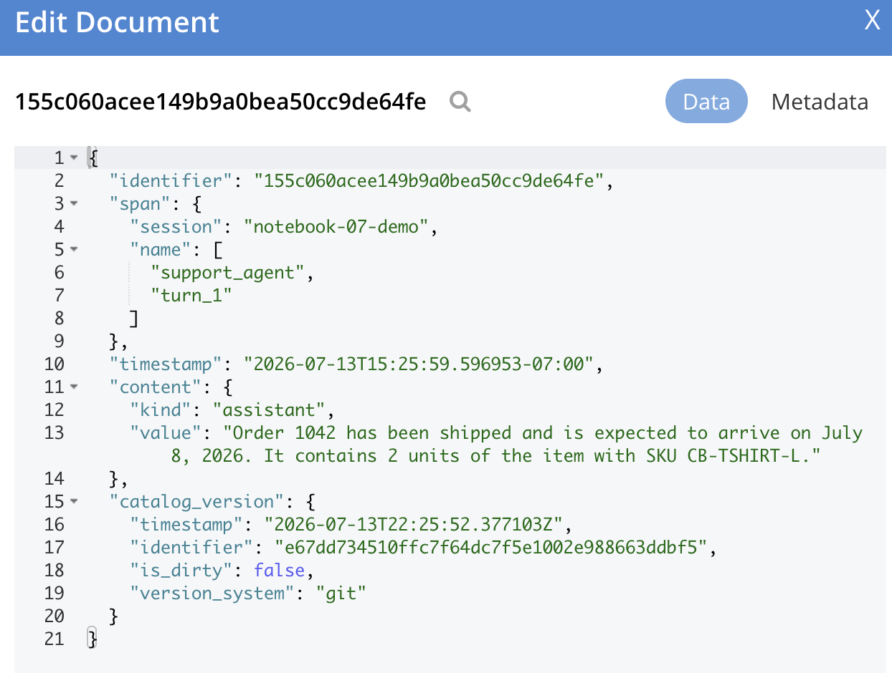

# Chapter 11: Orchestrating Agents With LangGraph

> Couchbase deliberately doesn't ship an orchestration framework. Orchestration is application logic, and there are a number of good options. This book uses LangGraph.

---

## 11.1 Why LangGraph

LangGraph models an agent as a state machine: typed state flowing through nodes (LLM calls, tools, routers) connected by edges (including conditional ones and cycles, the "loop" in LLM in a loop). That explicitness is what production agents need: you can draw the graph, test nodes in isolation, and, crucially for us, persist the state.

Everything Couchbase-side is already built: retrieval (Ch. 5–6), memory (Ch. 9), cataloged tools/prompts and audit (Ch. 10). This chapter is the assembly manual.

---

## 11.2 A Tool-Using Agent in One Call

`create_react_agent` gives you the standard tool calling loop. Tools are plain decorated functions, ours wrap the SDK:

```python
from langchain_core.tools import tool
from langgraph.prebuilt import create_react_agent

@tool
def search_docs(question: str) -> list[dict]:
    """Search product documentation for relevant passages."""
    return semantic_search(question, k=5)               # Chapter 5

@tool
def lookup_order(order_id: str) -> dict:
    """Fetch an order by its ID."""
    return orders_coll.get(f"order::{order_id}").content_as[dict]   # Chapter 2

agent = create_react_agent(
    "openai:gpt-4o-mini",
    tools=[search_docs, lookup_order],
)
agent.invoke({"messages": [("user", "Where is order 1042?")]})
```

Tool calling and the Capella switch don't automatically mix. Ch. 8's ChatOpenAI swap works for plain chat/generation, but check whether your Capella deployment's model actually supports tool calling before pointing a `create_react_agent` loop like this one at it. `apps/support-agent` hits exactly this: its available Capella models don't support tool calling at all, so that app hardcodes OpenAI for chat unconditionally (`agent/graph.py`'s `_make_chat_model()`) while its embeddings still switch to Capella when configured, since embeddings don't need tool calling.

---

## 11.3 Durable State: The Couchbase Checkpointer

By default that agent forgets everything between invocations and dies with the process mid-run.

A **checkpointer** persists graph state after every step, keyed by `thread_id`. Couchbase has a dedicated one:

```bash
pip install langgraph-checkpointer-couchbase
```

```python
from langgraph_checkpointer_couchbase import CouchbaseSaver

checkpointer = CouchbaseSaver.from_conn_info(
    cb_conn_str=CB_CONN_STRING, cb_username=CB_USERNAME, cb_password=CB_PASSWORD,
    bucket_name="ai", scope_name="agent",     # uses collections: checkpoints, checkpoint_writes
)

agent = create_react_agent(model, tools=tools, checkpointer=checkpointer)

config = {"configurable": {"thread_id": "u42::support::2026-07-05"}}
agent.invoke({"messages": [("user", "Where is order 1042?")]}, config)
agent.invoke({"messages": [("user", "And when will it arrive?")]}, config)  # remembers
```

(`AsyncCouchbaseSaver` mirrors it for async apps; both also construct `from_cluster(cluster=..., ...)` to reuse your SDK connection.)

What this buys, beyond multi-turn memory: **crash recovery** (re-invoke the thread; execution resumes from the last checkpoint), **human-in-the-loop** (interrupt the graph, resume after approval, state waits in Couchbase), and **time travel** (checkpoint history per thread is queryable).


*`span.name` (`["support_agent", "turn_1"]`) and `session` are exactly the keys a checkpointer or activity log needs to reconstruct "what did this thread do, in order."*

---

## 11.4 Wiring in the Memory Subsystem

Checkpoints persist *graph* state; they are not user-level memory. Chapter 9's memory plugs in as context assembly + a tool: the same two touch points whether you built it from primitives or use the managed Agent Memory server. The `apps/support-agent` uses the managed product (Ch. 9 §9.8); `recall`/`remember` here are its thin wrappers over the SDK:

```python
from typing import Annotated, TypedDict
from langgraph.graph import StateGraph, START, END, add_messages

class AgentState(TypedDict):
    messages: Annotated[list, add_messages]
    user_id: str
    memory_context: str

def load_context(state: AgentState) -> dict:
    """First node: recall relevant memories (§9.8), held as plain state, NOT a
    second system message. Degrades to no memories if the Agent Memory server
    is offline."""
    user_msg = state["messages"][-1].content
    memories = recall(state["user_id"], user_msg, k=5)     # search_memory(session_ids="all")
    memory_block = "\n".join(f"- {m['text']}" for m in memories) or "none"
    return {"memory_context": memory_block}

@tool
def save_memory(user_id: str, fact: str) -> str:
    """Save a durable fact about the user for future conversations."""
    return AgentMemory(user_id).remember(fact)             # add_memory(facts=[fact])
```

Why `memory_context` isn't a messages entry.

A node further down (§11.5) injects a prompt-record's instructions as a single *leading* system message. Some backends, the Capella Model Service is one, enforce strict role alternation after that: exactly one system message, then user/assistant/user/assistant.

Appending memories as a *second* system message here breaks that (`400: conversation roles must alternate`) on any backend that enforces it. Fold it into the human turn's content instead, at the point you're about to call the model. See `fold_memory_into_last_message` below.

The full graph in `apps/support-agent`:

```
START → load_context → agent (ReAct: search_docs, lookup_order, save_memory)
             |                    |
             +-- CouchbaseSaver checkpoints every step --> ai.agent.checkpoints
                                  |
                        escalate? +--> human_review node
                                  +--> END
```

---

## 11.5 Catalog-Driven Nodes

Chapter 10's prompt records specify a node completely (instructions + tools + output schema). The `agentc_langgraph` integration turns the record into the node:

```python
import agentc
import agentc_langgraph.agent
import langchain_openai
from langchain_core.messages import HumanMessage

def fold_memory_into_last_message(state: AgentState) -> dict:
    """New state for THIS ONE model call; the caller's original state["messages"]
    (what gets checkpointed) is left untouched, so the persisted conversation stays
    exactly what the user said."""
    if not state.get("memory_context") or not state.get("messages"):
        return state
    messages = list(state["messages"])
    last = messages[-1]
    messages[-1] = HumanMessage(
        content=f"Relevant memories about this user:\n{state['memory_context']}"
                f"\n\n{last.content}")
    return {**state, "messages": messages}


class SupportAgent(agentc_langgraph.agent.ReActAgent):
    def __init__(self, catalog: agentc.Catalog, span: agentc.Span):
        chat_model = langchain_openai.ChatOpenAI(model="gpt-4o-mini", temperature=0)
        super().__init__(chat_model=chat_model, catalog=catalog, span=span,
                         prompt_name="support_agent_node")     # ← the YAML record

    def _invoke(self, span, state, config):
        agent = self.create_react_agent(span)                  # tools & schema from the prompt
        invoke_state = fold_memory_into_last_message(state)
        response = agent.invoke(input=invoke_state, config=config)
        structured = response["structured_response"]           # matches the prompt's output schema
        state["needs_human"] = structured["needs_human"]
        state["messages"].append(("assistant", structured["response"]))
        return state
```

What you get for free: the prompt and tools come from the *published, Git-versioned* catalog; every model call, tool result, and node transition is logged to `ai.agent_activity.logs` in your `AGENT_CATALOG_BUCKET` via the built-in Spans/callbacks. Change the YAML, commit, and republish; the agent picks up the new version and the logs record which version answered which user.

Multi-agent graphs follow the same pattern. The agent-catalog travel example composes three `ReActAgent` nodes (front desk → endpoint finder → route finder) with conditional edges. Each node is defined by its own prompt record, and handoffs are logged as `EdgeContent`.

---

## 11.6 The State Architecture

One way to see the whole book at once, where a production agent's state lives:

| State | Collection | Written by | Chapter |
|---|---|---|---|
| Conversation turns | checkpointer / Agent Memory sessions | `CouchbaseSaver` / `add_memory(messages=…)` | 9, 11 |
| Graph execution state | `ai.agent.checkpoints{,_writes}` | `CouchbaseSaver` | 11 |
| Long-term memories | Agent Memory server (managed) | `save_memory` tool → `add_memory(facts=…)` | 9 |
| Knowledge (RAG) | `ai.docs.chunks` | ingestion / vectorization | 3–5 |
| Tools & prompts | `ai.agent_catalog.*` | `agentc publish` | 10 |
| Activity / audit | `ai.agent_activity.logs` | Spans (automatic) | 10 |
| Eval results | `ai.evals.*` | Ragas harness | 13 |

The LLM and the graph are stateless and disposable; every durable byte is in Couchbase, queryable with SQL++, secured by RBAC, and versioned where it matters. That's the thesis of this book, made concrete.

---

## 11.7 Production Notes

- **Thread ID design**: `user::purpose::date` gives natural session boundaries and makes checkpoint cleanup a ranged operation. Put a TTL policy on checkpoint collections; in-flight graphs don't need immortal history.
- **Idempotent tools**: LangGraph retries nodes; tools that mutate (Ch. 2 upserts with deterministic keys) should tolerate replay.
- **Interrupts for dangerous tools**: gate refunds/writes behind `interrupt_before=["dangerous_tool_node"]` + human approval; the checkpoint holds state while a human decides.
- **Model routing**: planner nodes earn a frontier model; extraction/summarization nodes run fine on a small Capella-hosted model (Ch. 8). It's one `ChatOpenAI(base_url=...)` per node.

Notebook: [`notebooks/07_agent_catalog_langgraph.ipynb`](../notebooks/07_agent_catalog_langgraph.ipynb). App: [`apps/support-agent`](../apps/support-agent/).

Running into errors? See [Troubleshooting](troubleshooting.md).

Next: [Chapter 12: The Couchbase MCP Server](12-mcp-server.md).
