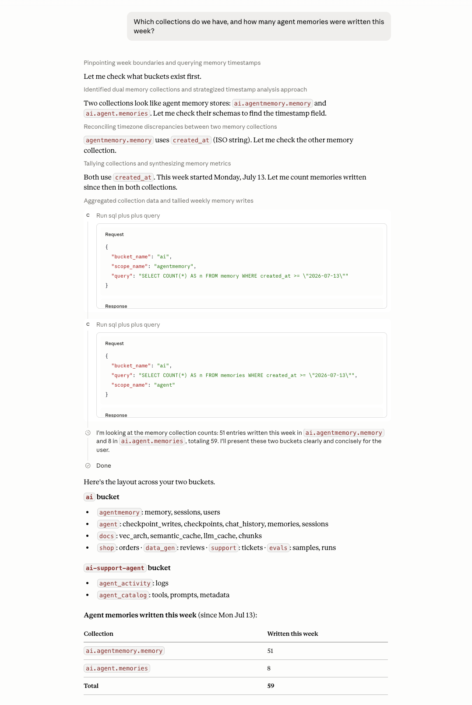

# Chapter 12: The Couchbase MCP Server

> *The Model Context Protocol (MCP) is the USB port of the agent ecosystem: one standard plug between AI tools and data systems. The Couchbase MCP server lets any MCP-capable client (Claude Desktop, Claude Code, Cursor, Windsurf, LangGraph agents, your own apps) browse, query, and modify Couchbase data as first-class tools.*

---

## 12.1 What MCP Is (and Is Not)

The [Model Context Protocol](https://modelcontextprotocol.io/) is an open protocol that standardizes how AI applications discover and call external capabilities. An **MCP server** exposes three kinds of primitives:

- **Tools**: functions the model may call (`run_sql_query`, `upsert_document`, …).
- **Resources**: readable data the client can load into context.
- **Prompts**: reusable prompt templates.

An **MCP client** (Claude Desktop, an IDE, or your own agent runtime) connects to servers over `stdio` (local subprocess) or streamable HTTP (remote), lists their tools, and lets the model call them.

MCP is *not* an orchestration framework and not an agent; it is the plumbing between agents and systems. In the Couchbase stack, MCP is how you give *third-party* AI tools access to your cluster without writing integration code. (Inside your own LangGraph apps you can either call the SDK directly, Chapters 2–9, or attach MCP tools; §12.5 shows both.)

---

## 12.2 The Couchbase MCP Server

Couchbase ships an open-source MCP server: [`Couchbase-Ecosystem/mcp-server-couchbase`](https://github.com/Couchbase-Ecosystem/mcp-server-couchbase). It is a Python server (FastMCP-based) that connects to a cluster with the same connection string and credentials the SDK uses, and exposes tools for the operations an AI assistant most commonly needs:

- **Discovery**: list scopes and collections in the configured bucket, retrieve collection structure/schema so the model can write correct SQL++.
- **Key-value**: get a document by ID, upsert a document, delete a document.
- **Query**: run a SQL++ query against a scope (this is the workhorse: the model writes SQL++, the server executes it).
- **Search / index helpers**: inspect indexes so the model can reason about what is queryable.

> The exact tool list grows with releases. Run the server and call `tools/list` (or just ask your MCP client to show available tools) for the current set. Treat this chapter's configs as the stable part.

Because the server talks to the cluster as a normal Couchbase user, **RBAC is your safety rail**: create a dedicated database user for MCP with the narrowest role that works (e.g., read-only `query_select` + `data_reader` on one scope for analysis use cases; add write roles only if you want the model to mutate data).

---

## 12.3 Running the Server

### With Claude Desktop / Claude Code / Cursor (stdio)

The server is distributed as a Python package runnable with `uvx`. Add it to your client's MCP config (`claude_desktop_config.json`, `.mcp.json`, etc.):

```json
{
  "mcpServers": {
    "couchbase": {
      "command": "uvx",
      "args": ["couchbase-mcp-server"],
      "env": {
        "CB_CONNECTION_STRING": "couchbases://cb.xxxx.cloud.couchbase.com",
        "CB_USERNAME": "mcp_readonly",
        "CB_PASSWORD": "…"
      }
    }
  }
}
```

(Credentials also work as `--connection-string`/`--username`/`--password` CLI args instead of env vars; both are honored. `notebooks/12_mcp_server.ipynb` uses the flag form for clarity. There's no bucket-scoping option: a `CB_BUCKET_NAME` env var here does nothing in the current server version; every tool takes `bucket_name` as an explicit parameter instead, scoped by RBAC rather than by server config.)

For Claude Code, the same thing as a one-liner:

```bash
claude mcp add couchbase \
  -e CB_CONNECTION_STRING="couchbases://cb.xxxx.cloud.couchbase.com" \
  -e CB_USERNAME="mcp_readonly" \
  -e CB_PASSWORD="…" \
  -- uvx couchbase-mcp-server
```

### As a Shared Remote Server (HTTP)

For team or server-side use, run it with the HTTP transport (flag names per the server's README; `--transport=http` with a `--port` is the common shape) behind your usual network controls, and point clients at the URL. Remote MCP servers should sit behind TLS and authentication just like any internal API.

### Local Dev Cluster

The examples in this repo run fine against a local cluster too:

```bash
docker run -d --name cb -p 8091-8097:8091-8097 -p 11210:11210 couchbase:enterprise
# then CB_CONNECTION_STRING=couchbase://localhost
```

---

## 12.4 What It Feels Like

Once connected, you converse with your data. A session in Claude Desktop against the `ai` bucket from this book:

> **You:** Which collections do we have, and how many agent memories were written this week?
>
> **Claude:** *(calls the list-collections tool, then runs)*
> ```sql
> SELECT COUNT(*) AS n
> FROM ai.agent.memories
> WHERE created_at >= DATE_ADD_STR(NOW_STR(), -7, 'day');
> ```
> You have scopes `docs`, `agent`, `evals`. 412 memories were written in the last 7 days…



*The same question, live: the model finds two memory-shaped collections it didn't know existed, checks both for a timestamp field, then runs one `run_sql_query` call per collection before combining the counts, exactly the "discover, then query" pattern this section describes.*

This pattern, *model writes SQL++, server executes, model interprets*, is why the schema-discovery tools matter: the model first inspects collection structure, then writes correct queries. It is also why you should give the MCP user read-only credentials unless you explicitly want write access.

---

## 12.5 Using MCP Tools Inside a LangGraph Agent

MCP is client-agnostic, so your own agents can consume the same server. The `langchain-mcp-adapters` package converts MCP tools into LangChain tools that bind directly into the LangGraph agents from Chapter 11:

```python
import asyncio
from langchain.agents import create_agent
from langchain_mcp_adapters.client import MultiServerMCPClient
from langchain_openai import ChatOpenAI

async def build_agent():
    client = MultiServerMCPClient(
        {
            "couchbase": {
                "transport": "stdio",
                "command": "uvx",
                "args": ["couchbase-mcp-server"],
                "env": {
                    "CB_CONNECTION_STRING": "couchbases://cb.xxxx.cloud.couchbase.com",
                    "CB_USERNAME": "mcp_readonly",
                    "CB_PASSWORD": "…",
                },
            }
        }
    )
    tools = await client.get_tools()          # MCP tools -> LangChain tools
    llm = ChatOpenAI(model="gpt-4o-mini", temperature=0)
    return create_agent(llm, tools=tools)

agent = asyncio.run(build_agent())
```

**When to Use MCP vs. the SDK in Your Own Agent:**

| | Direct SDK tools (Ch. 9–11) | MCP tools |
|---|---|---|
| Latency & control | Best in-process, typed | Extra hop, generic |
| Effort | You write each tool | Zero code, tools come with the server |
| Query surface | Exactly what you expose | Full SQL++ (bounded by RBAC) |
| Best for | Production agents with a fixed toolset | Assistants, ops/analytics copilots, prototyping |

A good production stance: hand-written, narrowly scoped SDK tools for the app's core actions; MCP for the long tail of ad-hoc data questions, and always through a least-privilege database user.

---

## 12.6 Security Checklist

1. **Dedicated user per MCP deployment**: never reuse app credentials.
2. **Read-only by default**: add `data_writer`/mutation roles only deliberately.
3. **Scope-level grants**: grant on `ai.docs`, not on `*`.
4. **Treat query results as untrusted context**: data returned into the model's context can contain adversarial text (prompt injection via documents). Keep write-capable tools out of sessions that read untrusted documents, or require human confirmation for writes.
5. **Log activity**: pair MCP access with Agent Catalog activity logging (Chapter 10) or audit logging on the cluster, so "what did the model run?" is answerable.

---

## 12.7 Where This Fits

- `notebooks/12_mcp_server.ipynb` runs everything in this chapter end-to-end: connect, list tools, call one directly, then wire them into a `create_agent` LangGraph agent and ask it a natural-language question (the exact pattern in §12.4/§12.5), executed for real against a live cluster.
- The **support-agent app** (`apps/support-agent`) includes an optional MCP wiring module (`agent/mcp_tools.py`) showing the LangGraph adapter above.
- Chapter 11 covers the orchestration the tools plug into; Chapter 10 covers cataloging and auditing those tools.

Running into errors? See [Troubleshooting](troubleshooting.md).

Next: [Chapter 13: Evaluating with Ragas](13-evaluation-ragas.md).
